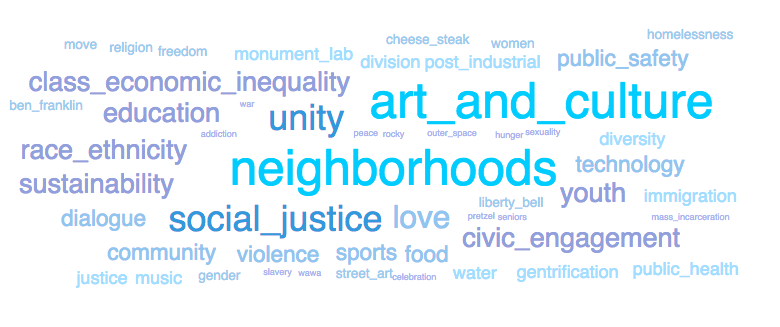
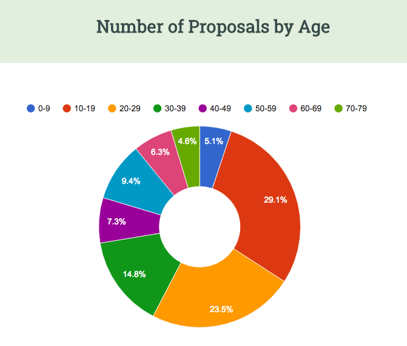

# Mini Data Visualization Project

A mini data visualization project using the Public Art Proposal data made available in Open Data Philly and collected by Monument Lab + Haverford Digital Scholarship. 

