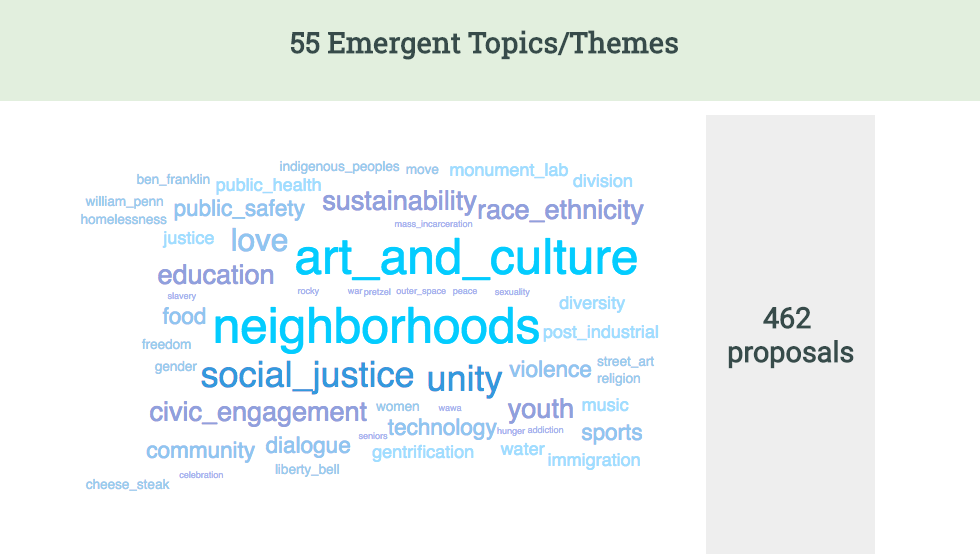
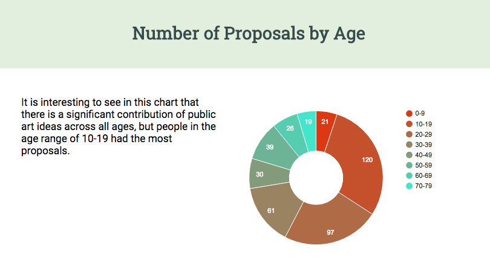

## Philadelphia Public Art Proposals: A Mini Data Visualization Project [Demo Link](https://kongsally.github.io/Mini-Data-Viz/index.html)

In the year 2015, the Monument Lab and the Haverford Digital Scholarship program collected 400+ public art proposals from Philadelphians, and made this data public through [Open Data Philly](https://www.opendataphilly.org/). I created this mini data visualization project to show how I used this open data to better understand the people involved in this project and the proposals they made. 

### [A step by step tutorial on how I made the visualizations](./tutorial.md)
 
#### Word cloud of proposal topics

#### Donut chart of proposals made by different age groups
